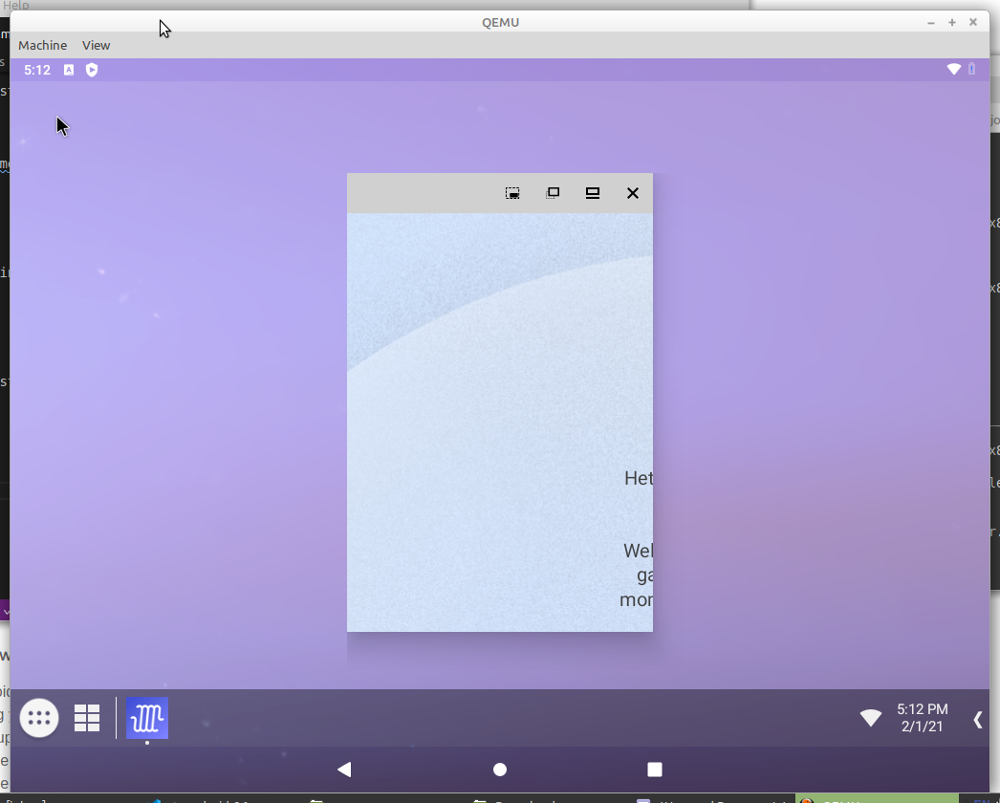

# Test with Android-x86 running under QEmu 

NOTE: this is really just virtualization, as full emulation would involve emulating ARM hardware!

Followed [this guide](https://linuxhint.com/android_qemu_play_3d_games_linux/), using Linux Mint host machine:

```
sudo apt install qemu qemu-kvm
sudo adduser `id -un` kvm
```
Reboot. Now create virtual hard disk:

```
qemu-img create -f qcow2 androidx86_hda.img 8G
```

Boot live image:

```
qemu-system-x86_64 \
-enable-kvm \
-m 2048 \
-smp 2 \
-cpu host \
-soundhw es1370 \
-device virtio-mouse-pci -device virtio-keyboard-pci \
-serial mon:stdio \
-boot menu=on \
-net nic \
-net user,hostfwd=tcp::5555-:22 \
-device virtio-vga,virgl=on \
-display gtk,gl=on \
-hda androidx86_hda.img \
-cdrom android-x86_64-9.0-r2.iso
```

BUT this results in this error:

```
qemu-system-x86_64: -display gtk,gl=on: GTK support is disabled
```

Google search on this error turned up [this](https://bugs.launchpad.net/ubuntu/+source/qemu/+bug/1859490):

> versions up to 2.11 (<=Bionic) used -display sdl and not yet GTK.
The GTK support got better and since 2.12 (>Bionic) Ubuntu qemu builds use GTK for the UI.

Which makes sense, as I'm using the 2.11.1 version of qemu. So compiled most recent (5.2) release from source using instructions [here](https://www.qemu.org/download/#source.) Note: requires Python Ninja package, so install this first. All steps:

```
python3 -m pip install --user ninja
wget https://download.qemu.org/qemu-5.2.0.tar.xz
tar xvJf qemu-5.2.0.tar.xz
cd qemu-5.2.0
./configure
make
sudo make install
```

Note "make" step will take a *long* time.

Running the newly compiled `qemu-system-x86_64` results in:

```
qemu-system-x86_64: OpenGL support is disabled.
```

After some fiddling it works with below settings (which disable use of OpenGL):

```
qemu-system-x86_64 \
-enable-kvm \
-m 2048 \
-smp 2 \
-cpu host \
-device ES1370 -device virtio-mouse-pci -device virtio-keyboard-pci \
-serial mon:stdio \
-boot menu=on \
-net nic \
-net user,hostfwd=tcp::5555-:22 \
-device virtio-vga \
-display gtk,gl=off \
-hda androidx86_hda.img \
-cdrom android-x86_64-9.0-r2.iso
```

Installation: folllow steps [here](https://linuxhint.com/android_qemu_play_3d_games_linux/). After install close QEMU window and restart using (same as above, but omitting -cdrom argument:):

```
qemu-system-x86_64 \
-enable-kvm \
-m 2048 \
-smp 2 \
-cpu host \
-device ES1370 -device virtio-mouse-pci -device virtio-keyboard-pci \
-serial mon:stdio \
-boot menu=on \
-net nic \
-net user,hostfwd=tcp::5555-:22 \
-device virtio-vga \
-display gtk,gl=off \
-hda androidx86_hda.img
```

BUT only boots into console. Most likely cause is lack of 3D acceleration support (OpenGL). Setting `-display`'s `gl` flag to "on" again results in:

```
qemu-system-x86_64: OpenGL support is disabled
```

It's not clear to me how to enable OpenGL support (by re-compiling QEMU? But using which flags?). Also found this:

<https://bugzilla.redhat.com/show_bug.cgi?id=1867343>

One of the responses to this issue:

> We can not enable spice GL by default because it blocks critical end user features like snapshots and the 'Save' option, because at the qemu level GL support is not wired up for memory migration. It definitely affects VM stablity too because there's a much larger and less tested interaction surface between qemu and the VM and that can lead to more crashes.

And (from 2019):

<https://forums.opensuse.org/showthread.php/539026-Can-t-enable-opengl-on-the-qemu-machine>

> Bottom line is that at least for running QEMU, right now well performing opengl is on the bleeding edge.

Other how-to guide from 2019:

<https://astr0baby.wordpress.com/2019/07/09/android-8-1-in-qemu-and-burp-suite-ssl-interception/>

From this I tried:

```
qemu-system-x86_64 -enable-kvm -boot c -cpu host -m 2048 -hda androidx86_hda.img
```

Which works! So let's go back to the original call and remove the virtio-vga device:

```
qemu-system-x86_64 \
-enable-kvm \
-m 2048 \
-smp 2 \
-cpu host \
-device ES1370 -device virtio-mouse-pci -device virtio-keyboard-pci \
-serial mon:stdio \
-boot menu=on \
-net nic \
-net user,hostfwd=tcp::4444-:5555 \
-hda androidx86_9_hda.img
```

Also works.

## Adb connection

As per [here](https://www.android-x86.org/documentation/debug.html):

```
adb connect 127.0.0.1:4444
```

## Install apps

Install Arize app:

```
adb -s 127.0.0.1:4444 install com.Triplee.TripleeSocial.apk
```

Result:

```
Performing Streamed Install
Success
```

Launch app: crashes immediately.


Immer App:

```
adb -s 127.0.0.1:4444 install app.immer.immer.apk
```

Result:

```
Performing Streamed Install
Success
```

Run the app - works, but on startup shows as:



Possib;e to click to user profile but display garbled. 