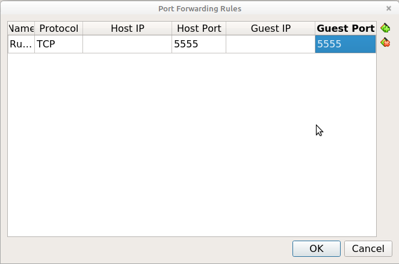

# Test with Android-x86 on VirtualBox + Android debug bridge

This largely follows [this blog post by Sjoerd Langkemper](https://www.sjoerdlangkemper.nl/2020/05/06/testing-android-apps-on-a-virtual-machine/). I used the pre-built Virtual Box image (Android-x86 9.0-R2, 64-bit). 

Note this:

> Testing on a virtual machine (VM) has some disadvantages. Testing on an actual Android phone is more reliable. Android is meant to run on ARM phones and not on x86 virtual machines, so things may randomly break when using a VM. Apps that ship with native libraries may not run at all in the VM, or they may run perfectly but don’t show up in the Play store.

This has implications for (long-term) accessibility!

Another useful resource:

<https://www.borncity.com/blog/2011/12/01/experimenting-with-ics-in-virtualbox-vmlite-vmware/>

## VM Installation

Works; needs some fiddling of VM settings (set graphics controller to VBoxSVGA, otherwise VM boots with black screen); also set number of processors to 2 because according to info [here](https://www.android-x86.org/documentation/virtualbox.html):

> Processor(s) should be set above 1 if you have more than one virtual processor in your host system. Failure to do so means every single app (like Google Chrome) might crush if you try to use it.

However, despite this, Chrome browser reliably crashes on text input in URL widget!

## Android Debug Bridge tests

First put Android in developer mode (don't know if this is really needed?).

Get ip address of VM as per post Langkemper. NOTE: if I go to Settings/System/About, listed value is `10.0.2.15`, which doesn't work for me. If I open the Terminal Emulator on the VM and enter:

```
ip a
```
 
First entry contains IP address `127.0.0.1` (localhost), which does work for me.

Connect to device:

```
adb connect 127.0.0.1
```

If this results in a "Connection refused" error, you might need to set a port forwarding rule. In VirtualBox, go to "Network" in your VM's settings. Click on "Advanced", followed by "Port Forwarding". Here, click on the green "+" icon (top-right). This adds a port forwarding rule. Now change the values of both "Host Port" and "Guest Port" to 5555 (defaults are 0):



Then try to connect again.

List connected devices:

```
adb devices -l
```

Result:

```
List of devices attached
127.0.0.1:5555         device product:android_x86_64 model:VirtualBox device:x86_64 transport_id:1
```

## Install app from local APK

Here, APK is locally downloaded package on host machine.

```
adb install com.Triplee.TripleeSocial.apk
```

Result:

```
Performing Streamed Install
Success
```

BUT app immediately crashes on startup. Apparently apps crashing under Android x86 is pretty common, see e.g.:

- [Android x86 on VirtualBox: App crashes on startup](https://stackoverflow.com/questions/60120347/android-x86-on-virtualbox-app-crashes-on-startup)

- [Android 9.0 x86 apps keep crashing - no native bridge](https://android.stackexchange.com/questions/225403/android-9-0-x86-apps-keep-crashing-no-native-bridge)

Perhaps the app really needs a native ARM architecture? 

Immer app:

```
adb install app.immer.immer.apk
```

Result:

```
Performing Streamed Install
Success
```

Launch: works! Some screenshots:


## ARM hardware emulation

[QEMU can emulate both 32-bit and 64-bit Arm CPUs](https://qemu.readthedocs.io/en/latest/system/target-arm.html). 

So this is possible, but can't find any recent instructions on how to make this work for Android.