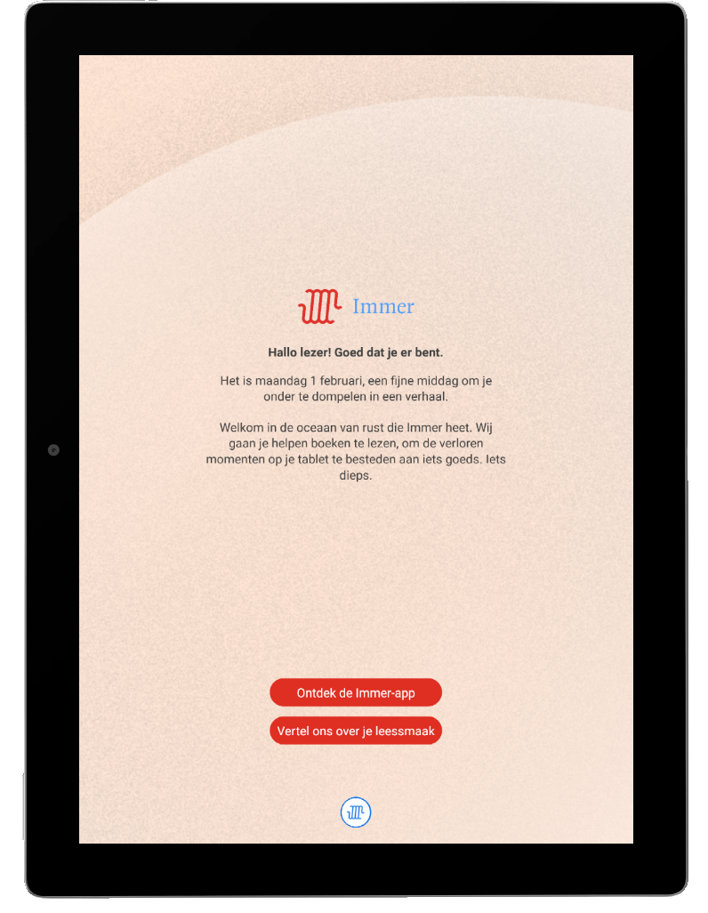
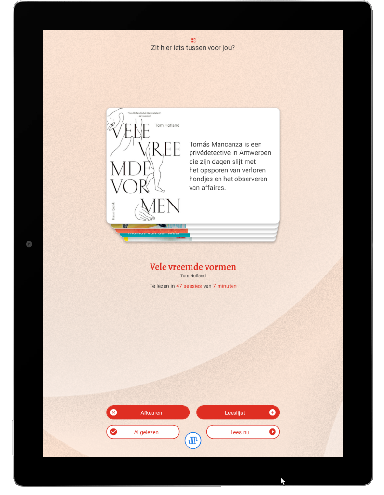
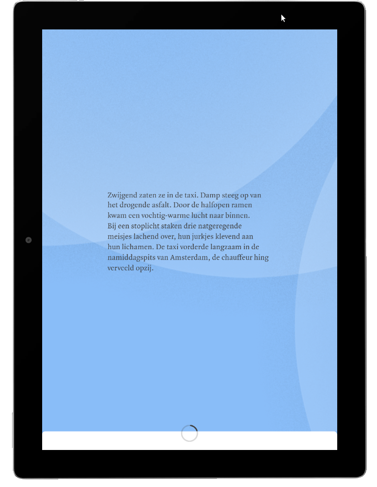

# Test with Android Studio Emulator

[Android Studio](https://developer.android.com/studio/) includes [Android Emulator](https://developer.android.com/studio/run/emulator).

Version used: 30.3.5.0 (build_id 7033400)

Explained [here](https://developer.android.com/studio/run/managing-avds). It's possible to set up  [Android Virtual Device](https://developer.android.com/studio/run/managing-avds) based on user-specified "hardware profile, system image, storage area, skin, and other properties". Both x86 and ARM system images are available. Uses wizard-like interface, very simple to set up.

As a test I set up a device with Android 9 (same as VirtualBox) using x86 image. Some tests:

Chrome browser - works without crashing.

Connect with Android Debug Bridge (note that again IP address listed in Settings/System/About does not work, but localhost does):

```
adb connect 127.0.0.1
```

List devices:

```
adb devices -l
```

Output:

```
List of devices attached
127.0.0.1:5555         device product:sdk_gphone_x86_arm model:AOSP_on_IA_Emulator device:generic_x86_arm transport_id:9
emulator-5554          device product:sdk_gphone_x86_arm model:AOSP_on_IA_Emulator device:generic_x86_arm transport_id:8
```

<strike>Note: 2 devices (don't really understand logic behind this?).</strike> Two devices because emulator automatically sets up a connection, so no need to do a manual adb connect. Anyway, [use `adb` with `-s` switch and device id to send commands to a specific device](https://developer.android.com/studio/command-line/adb#directingcommands):

```
adb -s 127.0.0.1:5555 shell pm list packages
```

Or:

```
adb -s emulator-5554 shell pm list packages
```

TODO: what's the difference between these 2 devices?

Install Arize app:

```
adb -s 127.0.0.1:5555 install com.Triplee.TripleeSocial.apk
```

Result:

```
Performing Streamed Install
Success
```

Launch app: works! But app needs camera, so let's test with webcam. See [How to use webcam in emulator](https://stackoverflow.com/a/30792615): shut down device, open AVD manager, go to Advanced Settings and set Front and Back Camera fields to Webcam0. However app freezes after some time, and VM becomes unresponsive (adb connect also fails). On re-boot it reboots in this error state. Fix: in AVD manager, change Boot option to "Cold boot".

Immer app:

```
adb -s 127.0.0.1:5555 install app.immer.immer.apk
```

Result:

```
Performing Streamed Install
adb: failed to install app.immer.immer.apk: Failure [INSTALL_FAILED_INSUFFICIENT_STORAGE]
```

Why does this happen? Default "Internal Storage" is only 800 MB, so change to 4GB. After this:

```
Performing Streamed Install
Success
```

Launch: works! Some screenshots:







BUT if app is launched w/o network connection only blank screen is shown.


## Using Emulator from command line

Explained [here](https://developer.android.com/studio/run/emulator-commandline).


## x86 vs ARM system images

From [Emulator 30.0.0 release notes](https://developer.android.com/studio/releases/emulator#support_for_arm_binaries_on_android_9_and_11_system_images):

> If you were previously unable to use the Android Emulator because your app depended on ARM binaries, you can now use the Android 9 x86 system image or any Android 11 system image to run your app – it is no longer necessary to download a specific system image to run ARM binaries. These Android 9 and Android 11 system images support ARM by default and provide dramatically improved performance when compared to those with full ARM emulation.

so x86 should be OK.

## Link with QEMU

From above page:

> The Android Emulator uses the Quick Emulator (QEMU) hypervisor. Initial versions of the Android Emulator used QEMU 1 (goldfish), and later versions use QEMU 2 (ranchu).

