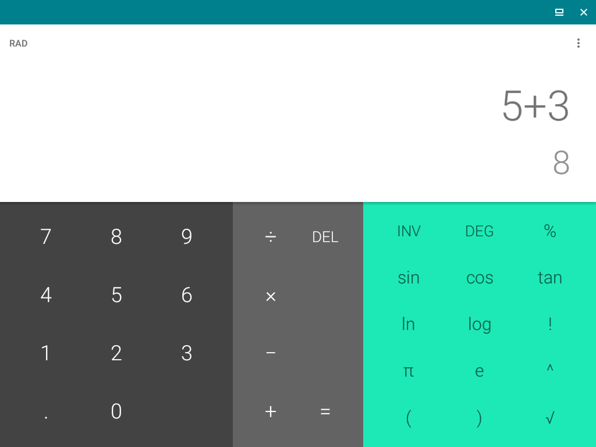

# Test with Anbox

[Anbox](https://github.com/anbox/anbox) "is a container-based approach to boot a full Android system on a regular GNU/Linux system like Ubuntu. In other words: Anbox will let you run Android on your Linux system without the slowness of virtualization".

After installation, start Anbox Application Manager from launcher menu. On startup it looks like this:

![./img/anbox-application-manager.png]

From what I see here, Anbox does not really emulate the "look and feel" of an actual Android environment. Instead:

> Android applications are mapped into single windows within the desktop environment. 

See for example calculator app:  



Note that:

> The Android runtime environment ships with a minimal customized Android system image based on the Android Open Source Project. The used image is currently based on Android 7.1.1

This is a very old version (2017). Installation of packages with Android Debug Bridge (adb); connection is set up automatically:

```
adb devices -l
```

Results in:

```
* daemon not running; starting now at tcp:5037
* daemon started successfully
List of devices attached
emulator-5558          offline transport_id:1
```

Install Arize app:

```
adb install com.Triplee.TripleeSocial.apk
```

Result:

```
Performing Streamed Install
adb: failed to install com.Triplee.TripleeSocial.apk: Failure [INSTALL_FAILED_NO_MATCHING_ABIS: Failed to extract native libraries, res=-113]
```

From [StackOverflow](https://stackoverflow.com/a/24572239):

> INSTALL_FAILED_NO_MATCHING_ABIS is when you are trying to install an app that has native libraries and it doesn't have a native library for your cpu architecture. For example if you compiled an app for armv7 and are trying to install it on an emulator that uses the Intel architecture instead it will not work..

Immer App:

```
adb install app.immer.immer.apk
```

Result:

```
Performing Streamed Install
Success
```

Launch app: works, but cannot connect to server (no network). Double-checked by:

```
adb shell ping google.com
```

Result:

```
ping: unknown host google.com
```

Apparently this is a [known issue](https://github.com/anbox/anbox/issues/1724).

